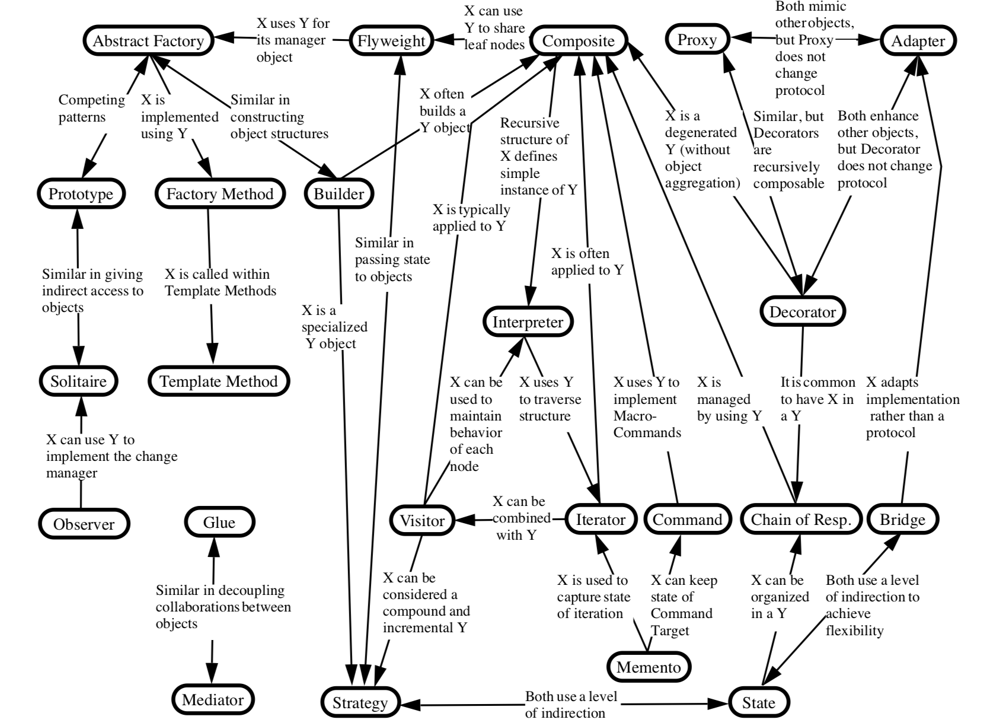

<a href="http://tiny.cc/plm19"></a><br>
&nbsp;<a href="http://tiny.cc/plm19">home</a> |
<a href="https://github.com/txt/plm19/blob/master/doc/syllabus.md">syllabus</a> |
<a href="https://github.com/txt/plm19/tree/master/src">src</a> |
<a href="http://tiny.cc/plm19give">submit</a> |
<a href="https://plm19.slack.com/">chat</a> |
<a href="https://github.com/txt/plm19/blob/master/LICENSE.md">&copy;2019</a> 
by <a href="http://menzies.us">Tim Menzies</a>

# Patterns

Experts are experts since they've learned patterns of useful behavior (fyi: expert = 5 patterns per day * 10 years)

If we look at N concrete things,  and then abstract our thinking a little,
then we can find some repeated features that might even apply to future things.

For example...

## Patterns in chess:

- more space in the center
- open lines
- weak squares
- pawn majority, pawn minority
- two weak points to attack - the Principle of Two Weaknesses
- weak kingside
- weak queenside pawn structures
- inactive knight at the corner
- dead bishop
- weak isolated d-pawn
- insufficient piece coordination
- attacking mark
- free protected pawn
- bishop pair
- better minor piece in open position - bishop versus knight
- better minor piece in blocked position - knight versus bishop
- break through
- and others etc. 

e.g forking:


## Patterns in Object Design


<a href="https://raw.githubusercontent.com/txt/seng18/master/img/gofpattern.jpg"></a>


Gang of Four (1994

Erich Gamma, Richard Helm, Ralph Johnson and John Vlissides 

If you read this book, and you are not excited, then check your pulse. You're dead.


Patterns are a religion


 
# "Patterns" in function programming
 
Functional programmers (Haskell, Clojure, F#, Lisp, Skill, Racket,….) make up 10 patterns for breakfast.

Cause its so easy (say what? OO makes some easy things hard?)

In LISP, one (and only one) recursive data type, the list which contains either
atoms
or another list

e.g. visitor pattern in functional (5 lines)

```lisp
(defun visitr (things f)
  "visitor patterns in functional programming"
  (if (atom things)
      (funcall f things)   ; then
      (dolist (one things) ; else do for each
         (visitr one f))))

(defun demo (&aux all)
  (let ((nastyComplexThing
     '(a 
       (b 1) 
       c
       (d e 
          (f g 
         (2 3 4)
         )
          h)
       (i j)
       (k
        (l
         (m
          (n o p q r 
         (s 5 6 7)
         (t 8 9 )
         u v w x y z)))))))
    (visitr nastyComplexThing
        (lambda (x)
          (if (numberp x)
          (push x all))))
    all))

(print(demo))

; output
; (9 8 7 6 5 4 3 2 1)
```

##  Creational Patterns

What:

- How objects are instantiated. 
- Encapsulate knowledge which concrete classes are used 
- Hide how instances of these classes are instantiated and put together.

e.g. [Abstract Factory](https://en.wikipedia.org/wiki/Abstract_factory_pattern#Python_example)

- Rather than building a concrete object, it’s building a family of related or dependent 
objects without specifying concrete class.
- Use when: system should be independent of how what it is producing is structured or represented.

e.g. [Builder](https://en.wikipedia.org/wiki/Builder_pattern)

- Separate how object is created from its representation, so the same process of creation can generate different representations.
- Use when: algorithm of creation is independent of the parts of the object.

e.g. Factory Method

- Gives an interface to build an object but let subclasses to decide which class to instantiate.
- Use when: a class wants its subclasses to decide which object to create.

e.g. Prototype
- Create objects by copying prototypical instance of them.
-  Use when: classes to instantiate are available only in runtime.

e.g. [Singleton](https://github.com/davidgf/design-patterns-in-ruby/blob/master/singleton.md)

- Ensures that a class has only one instance and gives global access to it.
- Use when: there must by only one instance of a class.

## Part II. Structural Patterns

These patterns are about how classes and objects are composed to build bigger structures.

e.g. [Adapter](https://github.com/davidgf/design-patterns-in-ruby/blob/master/adapter.md)

- With adapter pattern you can convert the interface of a class to another interface that is expected by the client.
- Use when: you want to use existing class but its interface does not match the one you need.

e.g. Bridge

- Decouple an abstraction from its implementation so that the two can vary independently. I described that pattern in my previous post.
- Use when: you want to avoid binding between abstraction and its implementation if for example each of them must be selected in runtime.

e.g. [Composite](https://github.com/davidgf/design-patterns-in-ruby/blob/master/composite.md)

- Compose objects into a tree structure to represent their hierarchies and allow client to treat them uniformly.
- Use when: you want to represent hierarchies of objects.

e.g. [Decorator](https://github.com/davidgf/design-patterns-in-ruby/blob/master/decorator.md)

- Allow add additional responsibilities to an object dynamically.
- Use when: you want to add extensions to an object in runtime without affecting other objects.

e.g. Facade

- Provide unified interface to a set of interfaces to make it easier to use them.
- Use when: you want to provide a simple interface to a complex subsystem.

e.g. Flyweight

- Use sharing to support large number of small objects.
- Use when: an application uses a lot of small objects and their storing is expensive or their identity is not important.

e.g. Proxy

- Provide placeholder for another object to control access. 
- There are few kinds:
     - remote proxy — provides local representation of an object in a different location/address space,
     - virtual proxy — creates expensive objects lazily only when they are needed,
     -  protection proxy — controls access to the original object.

## Part III. Behavioral Patterns

Behavioral patterns are about how problems are solved and how responsibilities are splitted between objects. They are more about comunnication than structure.

e.g. Chain of Responsibility

- Decouple sender of a request from its receiver by giving more than one object a chance to handle that request.
- Use when: more than one object can handle a request and that information is known in runtime.

e.g. [Command](https://github.com/davidgf/design-patterns-in-ruby/blob/master/command.md)

- Encapsulate a request as an object.
- Use when: you have a queue of requests to handle or you want to log them. Also when you want to have “undo” action.

e.g. [Interpreter](https://github.com/davidgf/design-patterns-in-ruby/blob/master/interpreter.md)

- Interprets a sentence in a given language by using representation of a grammar in that language.
- Use when: you want to interpret given language and you can represent statements as an abstract syntax trees.
- e.g. parsing = generation of a composite of commands


e.g. [Iterator](https://github.com/davidgf/design-patterns-in-ruby/blob/master/iterator.md)

- Provide a way to access elements of an aggregated objects sequentially without exposing how they are internally stored.
- Use when: you want to access object’s content without knowing how it is internally represented.

e.g. Mediator

- Define an object that knows how other objects interact. It promotes loose coupling by removing direct references to objects.
- Use when: a set of objects communicate in structured by complex ways.

e.g. Memento

- Capture external state of an object if there will be a need to restore it without violating encapsulation.
- Use when: you need to take a snapshot of an object.

e.g. [Observer](https://github.com/davidgf/design-patterns-in-ruby/blob/master/observer.md)

- When one object changes state, all its dependents are notified about that fact.
- Use when: a change to one object requires changing others.

e.g. State

- Object is allow to change its behaviour when its internal state changes. It looks like the object is changing its class.
- Use when: the object’s behaviour depends on its state and its behaviour changes in run-time depends on that state.

e.g. [Strategy](https://github.com/davidgf/design-patterns-in-ruby/blob/master/strategy.md)

- It lets to algorithm to be independent from clients that use it.
- Use when: you have many classes that differ in their behaviour. Strategies allow to configure a class with one of many behaviours.

e.g. [Template Method](https://github.com/davidgf/design-patterns-in-ruby/blob/master/template_method.md)

- Define the skeleton of an algorithm in an operation, deferring some steps to subclasses. Template Method lets subclasses redefine certain steps of an algorithm without changing the algorithm’s structure.
- Use when: you have to define steps of the algorithm once and let subclasses to implement its behaviour.

e.g. Visitor

- Represent an operation to be performed on the elements of the structure. It lets you to define new operations without changing the classes of the elements.
- Use when: an object structure includes many classes and you want to perform an operations on the elements of that structure that depend on their classes.


<a href="../etc/img/patterns.png"></a>

## Documenting a Pattern

For the official version, see [here](https://hillside.net/index.php/gang-of-four-template):

For my version, see here:

- Intent (or "Problem")
- Stucture (or "Solution")
- Examples
- Rules of Thumb (optional)
- See also

For examples, see our weekly summaries.

## Other

- [Patterns in Haskell](http://blog.ezyang.com/2010/05/design-patterns-in-haskel/)

