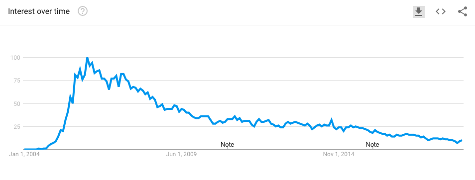

<a href="http://tiny.cc/plm19"></a><br>
&nbsp;<a href="http://tiny.cc/plm19">home</a> |
<a href="https://github.com/txt/plm19/blob/master/doc/syllabus.md">syllabus</a> |
<a href="https://github.com/txt/plm19/tree/master/src">src</a> |
<a href="http://tiny.cc/plm19give">submit</a> |
<a href="https://plm19.slack.com/">chat</a> |
<a href="https://github.com/txt/plm19/blob/master/license.md">&copy;2019</a> 
by <a href="http://menzies.us">Tim Menzies</a>


# Ruby

Ever wonder what happened to Smalltalk? Well, here's some Ruby code:

```ruby
(1..5).each do |counter|
  puts "iteration #{counter}"
end

array.each do |element|
  puts "#{element} is part of the array"
end

hash.each do |key, value|
  puts "#{key} is #{value}"
end

array = [1,2,3,4,5]
doubled = array.map do |element|
  element * 2
end
puts doubled
```

Looks familiar?

<a href="https://i.stack.imgur.com/1taqB.png"></a>

So Ruby is cool, right?

Well, in 2005, it was blowing up. "Ruby on Rails" was built around
 a large set of common design patterns

## Proxy

`PROXY`s to implement DRY, (don't repeat yourself).

- So in Rails, we specify one thing once then use it everywhere.
- E.g. if Age has the range 0..120 then there is a `Proxy` class
  where that constraint is specified, then reused in classes handling the 
  interface  (when folks
  are editing ages) and in the databases when creating the
  relational database.

## MVC: `MODEL, VIEW, CONTROLLER`

(naming issues: RoR `Model` is different to the Data-Model-Dialog model)

- _**Models**_ :
A model represents the information (data) of the application and the rules to manipulate that data. In the case of Rails, models are primarily used for managing the rules of interaction with a corresponding database table. In most cases, one table in your database will correspond to one model in your application. The bulk of your application’s business logic will be concentrated in the models.

- _**Views**_ :
Views represent the user interface of your application. In Rails, views are often HTML files with embedded Ruby code that performs tasks related solely to the presentation of the data. Views handle the job of providing data to the web browser or other tool that is used to make requests from your application.

- _**Controllers**_:
Controllers provide the “glue” between models and views. In Rails, controllers are responsible for processing the incoming requests from the web browser, interrogating the models for data, and passing that data on to the views for presentation.
 also called a Model-View-Controller)

## And What Happenned to Rails?


Ruby on Rails had problems with  scalability, error testing, speed and magical methods can cause frustration and technical debt. That led to many companies to abandon Ruby on Rails or use it just for projects, and choose other languages that offer easier expansion and lower long-term costs like the MEAN stack or constants like Python and Java.



